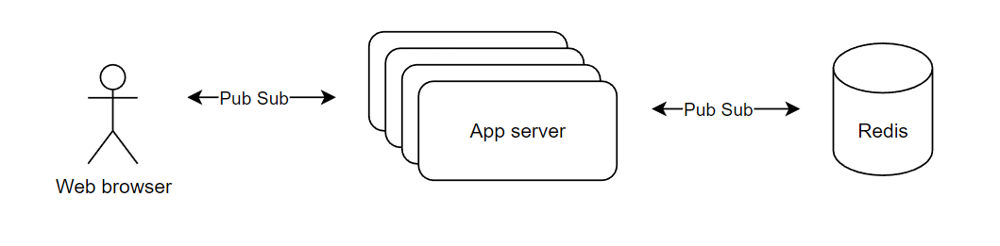

# rust-chat-server

Proof of concept chat server in rust

## Overview



## Requirements

It needs Redis server for broadcasting between web socket servers. Run `docker run --name redis -d -p 6379:6379 redis`

## Benchmark

소수 클라 다수 채팅

```log
[2022-08-13T12:35:59.766Z INFO  ws_client] status: Status(0, 0, 0)
[2022-08-13T12:36:02.766Z INFO  ws_client] status: Status(27862, 1441, 29)
[2022-08-13T12:36:05.765Z INFO  ws_client] status: Status(228848, 5848, 59)
[2022-08-13T12:36:08.765Z INFO  ws_client] status: Status(778804, 13223, 88)
[2022-08-13T12:36:11.765Z INFO  ws_client] status: Status(1832541, 23560, 118)
[2022-08-13T12:36:14.766Z INFO  ws_client] status: Status(3119116, 36857, 148)
[2022-08-13T12:36:17.766Z INFO  ws_client] status: Status(4354660, 53118, 177)
[2022-08-13T12:36:20.765Z INFO  ws_client] status: Status(4427119, 72345, 207)
[2022-08-13T12:36:23.767Z INFO  ws_client] status: Status(5743844, 93972, 236)
[2022-08-13T12:36:26.796Z INFO  ws_client] status: Status(7223532, 118841, 265)
[2022-08-13T12:36:29.766Z INFO  ws_client] status: Status(8121032, 146514, 294)
[2022-08-13T12:36:32.769Z INFO  ws_client] status: Status(9232407, 176851, 323)
[2022-08-13T12:36:35.767Z INFO  ws_client] status: Status(10518394, 209990, 352)
[2022-08-13T12:36:38.771Z INFO  ws_client] status: Status(11335881, 246252, 382)
[2022-08-13T12:36:41.831Z INFO  ws_client] status: Status(12593727, 285575, 412)
[2022-08-13T12:36:44.767Z INFO  ws_client] status: Status(13857793, 326069, 441)
[2022-08-13T12:36:47.766Z INFO  ws_client] status: Status(15168297, 370869, 470)
[2022-08-13T12:36:50.765Z INFO  ws_client] status: Status(16293584, 418192, 500)
[2022-08-13T12:36:53.765Z INFO  ws_client] status: Status(17544683, 467535, 529)
[2022-08-13T12:36:56.765Z INFO  ws_client] status: Status(18581976, 520339, 559)
[2022-08-13T12:36:59.765Z INFO  ws_client] status: Status(19617200, 576101, 588)
[2022-08-13T12:37:02.767Z INFO  ws_client] status: Status(20800965, 632188, 618)
[2022-08-13T12:37:05.765Z INFO  ws_client] status: Status(22052654, 693897, 647)
[2022-08-13T12:37:08.767Z INFO  ws_client] status: Status(22912046, 756574, 676)
[2022-08-13T12:37:11.775Z INFO  ws_client] status: Status(23982270, 821846, 706)
[2022-08-13T12:37:14.767Z INFO  ws_client] status: Status(25012865, 889076, 735)
[2022-08-13T12:37:17.766Z INFO  ws_client] status: Status(26000036, 960314, 764)
[2022-08-13T12:37:20.766Z INFO  ws_client] status: Status(26758678, 1034104, 794)
[2022-08-13T12:37:23.766Z INFO  ws_client] status: Status(27740183, 1109595, 823)
[2022-08-13T12:37:26.769Z INFO  ws_client] status: Status(28564832, 1187617, 852)
[2022-08-13T12:37:29.767Z INFO  ws_client] status: Status(29674480, 1267397, 881)
```

다수 클라 소수 채팅

```log
[2022-08-13T12:40:52.299Z INFO  ws_client] status: Status(0, 0, 0)
[2022-08-13T12:40:55.298Z INFO  ws_client] status: Status(33410, 258, 258)
[2022-08-13T12:40:58.299Z INFO  ws_client] status: Status(177072, 606, 521)
[2022-08-13T12:41:01.298Z INFO  ws_client] status: Status(518183, 1129, 784)
[2022-08-13T12:41:04.298Z INFO  ws_client] status: Status(1163041, 1827, 1048)
[2022-08-13T12:41:07.298Z INFO  ws_client] status: Status(2087081, 2614, 1313)
[2022-08-13T12:41:10.298Z INFO  ws_client] status: Status(3515710, 3644, 1570)
[2022-08-13T12:41:13.298Z INFO  ws_client] status: Status(5049434, 4723, 1824)
[2022-08-13T12:41:16.298Z INFO  ws_client] status: Status(6549908, 5892, 2037)
[2022-08-13T12:41:19.299Z INFO  ws_client] status: Status(8108222, 7116, 2228)
[2022-08-13T12:41:22.299Z INFO  ws_client] status: Status(9623912, 8347, 2469)
[2022-08-13T12:41:25.321Z INFO  ws_client] status: Status(11103480, 9694, 2714)
[2022-08-13T12:41:28.298Z INFO  ws_client] status: Status(12559812, 11131, 2893)
[2022-08-13T12:41:31.298Z INFO  ws_client] status: Status(13991350, 12609, 3147)
[2022-08-13T12:41:34.298Z INFO  ws_client] status: Status(15411669, 14191, 3416)
[2022-08-13T12:41:37.298Z INFO  ws_client] status: Status(16837747, 15779, 3670)
[2022-08-13T12:41:40.298Z INFO  ws_client] status: Status(18266812, 17469, 3920)
[2022-08-13T12:41:43.383Z INFO  ws_client] status: Status(19737867, 19234, 4136)
```

3초동안 만개가 넘는 채팅 건수 브로드캐스팅 처리가 되는거 확인함 IO 성능의 한계로 로컬에서의 테스트는 한계가 있음 CPU 만 100% 도달하긴 하는데 IO 상태가 450MB/s 로 한계라서 그런거 같음 레디스는 이 당시 80MB/s 였음 cpu는 8% 미만 메모리는 100MB 미만으로 상당히 여유가 있었음.
